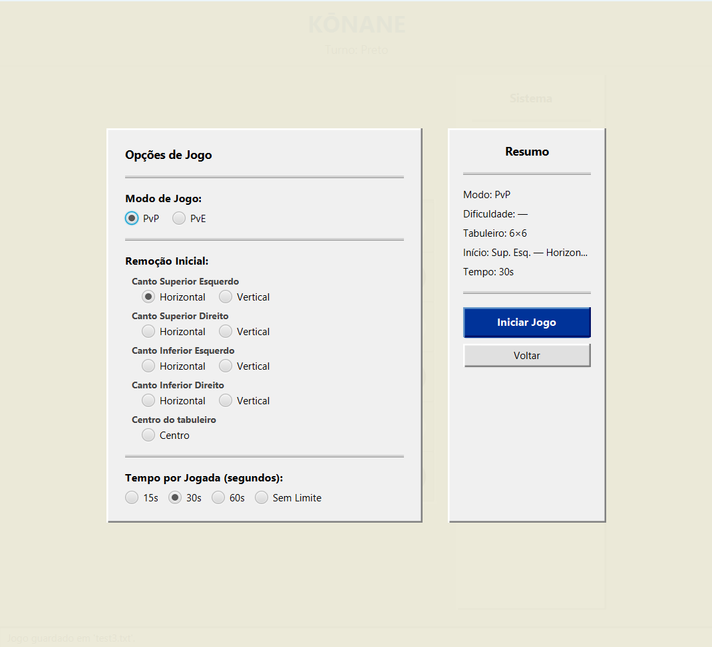
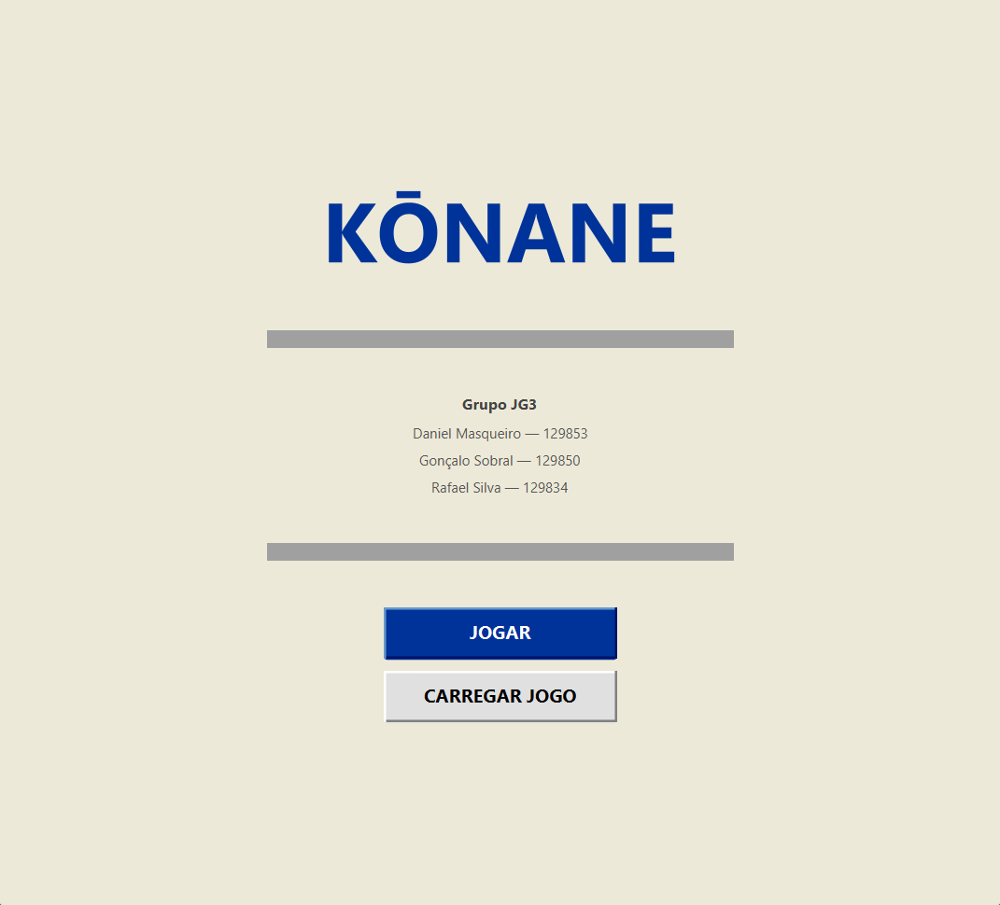
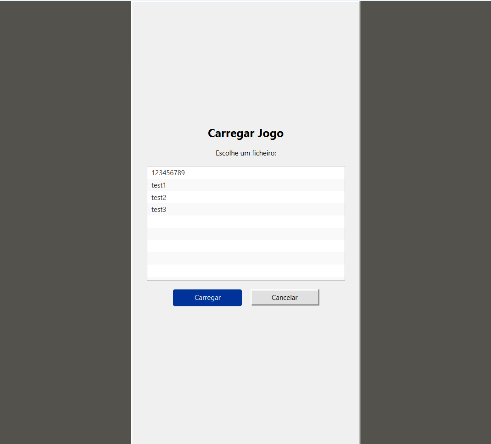

# Konane

A Scala implementation of the traditional Hawaiian board game **Konane**, built from scratch as a university project, with both a text-based (TUI) and graphical (GUI) interface. Capture your opponent's pieces by jumping over them - the player who runs out of valid moves loses.

> Built as a university project (ISCTE - Programação Multiparadigma) using Scala and JavaFX, with a strong focus on functional: immutability, tail recursion, parallel collections, MVC-style UI architecture, and the Observer pattern via JavaFX event handling.


## Gameplay

- Two players alternate turns as **Black** and **White**, jumping over and capturing the opponent's adjacent pieces.
- A piece can make multiple captures in a single turn - you can stop at any point or continue the chain.
- The player who cannot make any valid move on their turn **loses**.
- Play against a friend (PvP) or challenge the computer (PvE) in three difficulty levels.

**Controls (GUI)**

| Action | How |
|---|---|
| Select a piece | Click on it (highlights valid destinations in blue) |
| Move | Click a highlighted destination |
| Continue multi-capture | Keep clicking valid destinations, or press **Parar Captura** to end early |
| Undo last move | **Desfazer** button |
| Restart | **Reiniciar** button |
| Save / Load | **Guardar Jogo** / **Carregar Jogo** buttons |
| Return to menu | **Menu Principal** button |

**Controls (TUI)**

| Input | Action |
|---|---|
| Row + Column (e.g. `2 B`) | Enter a coordinate |
| `J` | Play a move |
| `U` | Undo |
| `S` | Save game |
| `M` | Return to main menu |
| `?` | Help |

---

## Features

- **Dual interface** - fully playable TUI (terminal) and JavaFX GUI, sharing the same game logic layer.
- **6×6 board** with configurable initial stone removal (4 corners × horizontal/vertical, or centre).
- **Per-turn timer** - choose 15 s, 30 s, 60 s, or unlimited; time runs out and the turn passes automatically.
- **Three AI difficulty levels** - random, mobility-maximising (medium), and capture-maximising (hard).
- **Multi-jump captures** - chain multiple hops in a single turn, with the option to stop early.
- **Undo history** - immutable `List[GameState]` lets you step back as many moves as you like.
- **Save and load** - games are persisted to plain-text `.txt` files and can be resumed from either the menu or mid-game.
- **Parallel board processing** - the board is a `ParMap[Coord2D, Stone]`, using Scala's parallel collections for move generation.



---

## Functional Design

This project's main goal was combining functional and object-oriented paradigms in Scala 3:

- **Immutability throughout** - `GameState` is a `case class`; every move produces a new state via `.copy(...)`. No mutable game state ever exists.
- **Tail recursion** - the TUI's `startMenu`, `gameLoop`, and `humanTurn` functions are all `@tailrec`, replacing imperative loops with pure recursive calls.
- **Parallel collections** - `Board` is defined as `ParMap[Coord2D, Stone]`, allowing move generation (`allValidMoves`) to run across CPU cores.
- **Purely functional game logic** - `GameLogic`, `WinChecker`, and `BoardPrinter` are `object`s with no mutable state; they take data in and return data out.
- **MVC-style GUI** - each screen has its own FXML file and controller class (`MenuController`, `SettingsController`, `GUI`). Logic and rendering are fully separated.
- **Shared configuration** - `GameConfig` is a Scala `object` (singleton) that carries settings between screens without coupling controllers to each other.
- **Custom pure PRNG** - `MyRandom` is an immutable `case class` that threads its seed explicitly, avoiding any reliance on mutable random state.

---

## Game Elements

### Board

The board is a `ParMap[(Int, Int), Stone]` - a parallel map from coordinates `(row, col)` to the stone occupying that cell. Empty cells are absent from the map. The initial board is generated by `Board.initKonaneBoard`, which fills a full alternating Black/White grid and removes two adjacent stones from a corner or the centre.

### Stones

| Stone | Colour | Notes |
|---|---|---|
| **Black** | ● | Moves first |
| **White** | ○ | Moves second |

### Valid Moves

A piece can jump over an **orthogonally adjacent** enemy piece into the empty cell beyond it (distance of 2). The jumped piece is captured and removed. Multiple such jumps can be chained in a single turn from the same piece.

### Win Condition

Checked by `WinChecker.checkWinner` after every move: if the current player has no valid moves, the opponent wins.

---

## AI Difficulty

| Level | Strategy |
|---|---|
| **Easy** | Picks a move at random |
| **Medium** | Picks the move that maximises the AI's own future move count |
| **Hard** | Picks the move that captures the most enemy pieces |

The AI also handles multi-jump chains automatically, greedily continuing captures until none remain.

---

## Project Structure

```
├── src/test/scala/
│   ├── logic/
│   │   ├── GameLogic.scala       # move validation, play(), allValidMoves()
│   │   └── WinChecker.scala      # checkWinner(), checkWin()
│   ├── model/
│   │   ├── Types.scala           # Coord2D, Board, Stone enum
│   │   ├── GameState.scala       # immutable game state + GameTimer
│   │   ├── Board.scala           # board initialisation
│   │   └── MyRandom.scala        # pure functional PRNG
│   ├── ui/
│   │   ├── TUI.scala             # text interface (tail-recursive game loop)
│   │   ├── GUI.scala             # JavaFX controller (main game screen)
│   │   ├── MenuController.scala  # JavaFX controller (main menu)
│   │   ├── SettingsController.scala # JavaFX controller (settings screen)
│   │   ├── GameConfig.scala      # singleton config shared between screens
│   │   └── BoardPrinter.scala    # pure board renderer for TUI
│   ├── Controller.fxml           # game screen layout
│   ├── MenuScreen.fxml           # main menu layout
│   ├── SettingsScreen.fxml       # settings screen layout
│   ├── Main.scala                # entry point (choose TUI or GUI)
│   └── MainGUI.scala             # JavaFX Application launcher
└── build.sbt
```

---

## Running the Project

**Requirements:** JDK 17+, SBT

```bash
git clone <repo-url>
cd <project-folder>
sbt run
```

You will be prompted to choose between **TUI** (1) and **GUI** (2).

To run the GUI directly:

```bash
sbt "runMain MainGUI"
```

---

## Screenshots

| Menu | Settings | Load |
|---|---|---|
|  |  |  |

---

## Authors

- **Gonçalo Sobral**
- **Daniel Masqueiro**
- **Rafael Silva**

Developed as coursework for the *Programação Multiparadigma* course at ISCTE.

---

## License

Copyright (c) 2026 Gonçalo Sobral, Daniel Masqueiro, Rafael Silva. All rights reserved.

This repository is public for portfolio and evaluation purposes - feel free to clone it and run it locally to see the project in action. However, no permission is granted to copy, reuse, or redistribute this code, in whole or in part, without explicit permission from the authors.